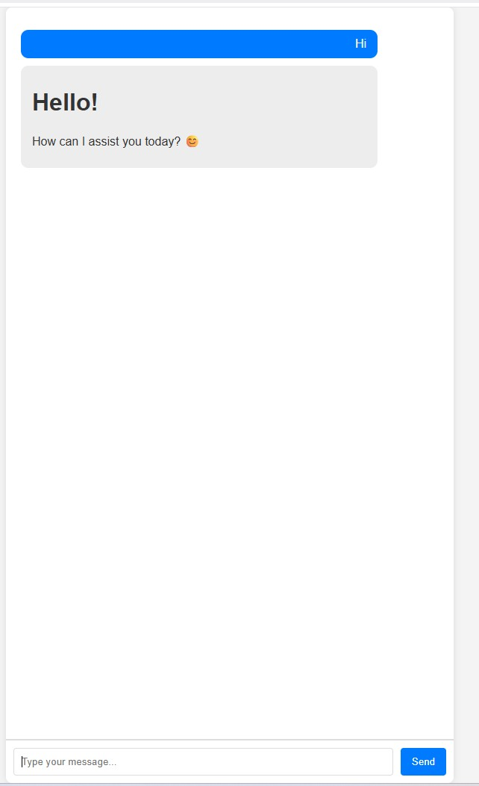
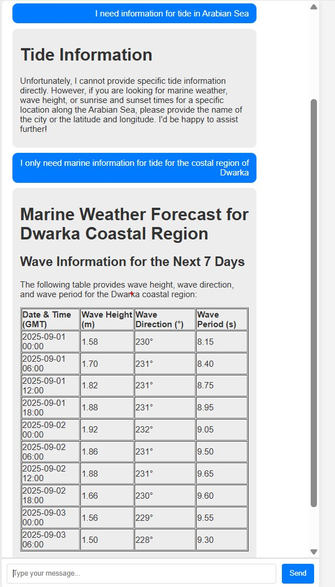
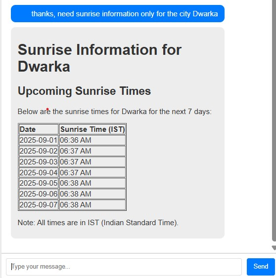
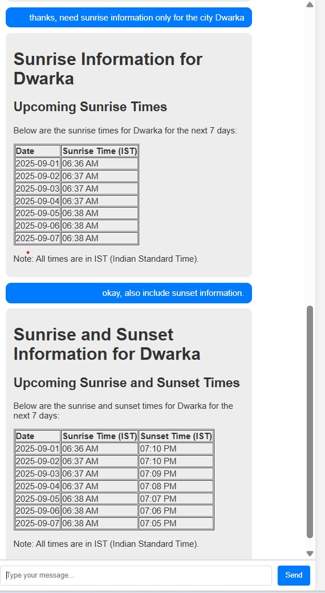

# ai-forecaster-chat-agent
A Spring Boot application that integrates Azure OpenAI to provide an AI-powered chat agent for forecasting sunrise, sunset times, and marine weather conditions. Includes RESTful endpoints and automated CI for building and testing.

## Prerequisites

- Azure OpenAI resource (for AI-powered features)
- You must have access to Azure OpenAI and obtain the endpoint URL and API key.

# AI Sunrise, Sunset & Marine Weather Forecaster API

A Spring Boot application providing sunrise, sunset, and marine weather forecasting via a single endpoint.

## Features

- AI-powered chat agent using Langchain4j & Azure OpenAI
- Sunrise and sunset time calculation
- Marine weather forecast API integration
- Configurable AI service URL and API key

## Retrieval-Augmented Generation (RAG)

This application uses a RAG mechanism to enhance AI responses with real-time data fetched from open-metio. 

The workflow:

1. Fetches data from external APIs (e.g., marine weather, sunrise, sunset).
3. Uses relevant retrieved data as context for AI-powered chat responses.

This approach ensures that forecasts and an

## Requirements

- Java 21+
- Maven 3.8+
- Spring Boot 3.x

## Setup

1. Clone the repository.
2. Configure properties in `src/main/resources/application.properties`.
3. Build and run:

    ```sh
    mvn clean install
    mvn spring-boot:run
    ```

## Endpoint

### AI Chat

- **GET** `/chat`
    - Parameters: `?input=your_message`

- Returns AI-powered chat response using Azure OpenAI.
- Returns sunrise, sunset, or marine weather forecast based on query parameters.

## Configuration

- Set the following properties in `src/main/resources/application.properties`:

- You can also set them as environment variables:

```sh
export AZURE_OPENAI_KEY=<your-azure-openai-api-key>
export AZURE_OPENAI_ENDPOINT=<your-azure-openai-endpoint-url>
```

## Testing

Run unit and integration tests:

```sh
mvn test
```

## Demo




